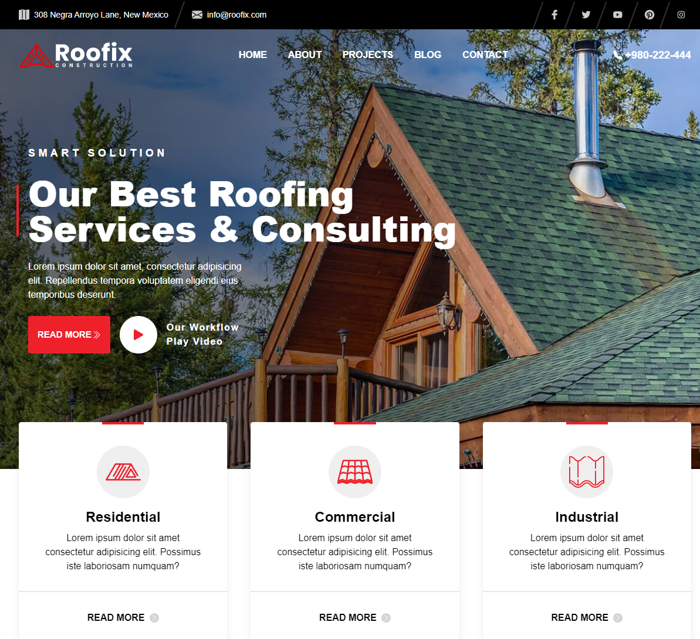

# Roofix Construction

A dedicated service-oriented company specializing in comprehensive roofing solutions. Roofix Construction offers a wide array of roofing services, including repairs, installations, inspections, and maintenance.

## Table of contents

- [Overview](#overview)
  - [Links](#links)
  - [Features](#features)
  - [Built with](#built-with)
  - [Screenshot](#screenshot)
- [Author](#author)
- [Acknowledgments](#acknowledgments)

## Overview

### Links

- Live Site URL: [Live Demo](https://kagiso31.github.io/roofix-construction)

### Features

- Responsive Design
- Accessible Carousel
- Accessible Tabs
- Google Maps API

### Built with

- Semantic HTML5 markup
- Mobile-first workflow
- [React](https://reactjs.org/) - JS library
- [Tailwind CSS](https://tailwindcss.com/) - CSS Framework

### Screenshot

## Author

- Website - [Kagiso Mokou](https://kagiso31.github.io/portfolio)
- LinkedIn - [Kagiso Mokou](https://www.linkedin.com/in/kagiso-mokou-50824a264)

## Acknowledgments

Design by - [RadiusTheme](https://www.radiustheme.com/)
